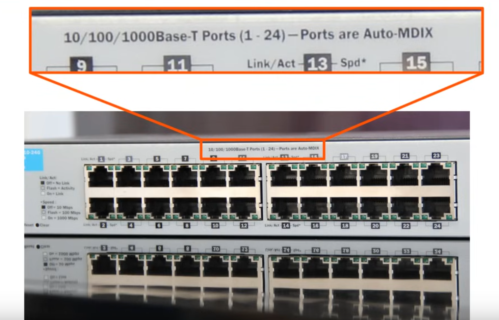
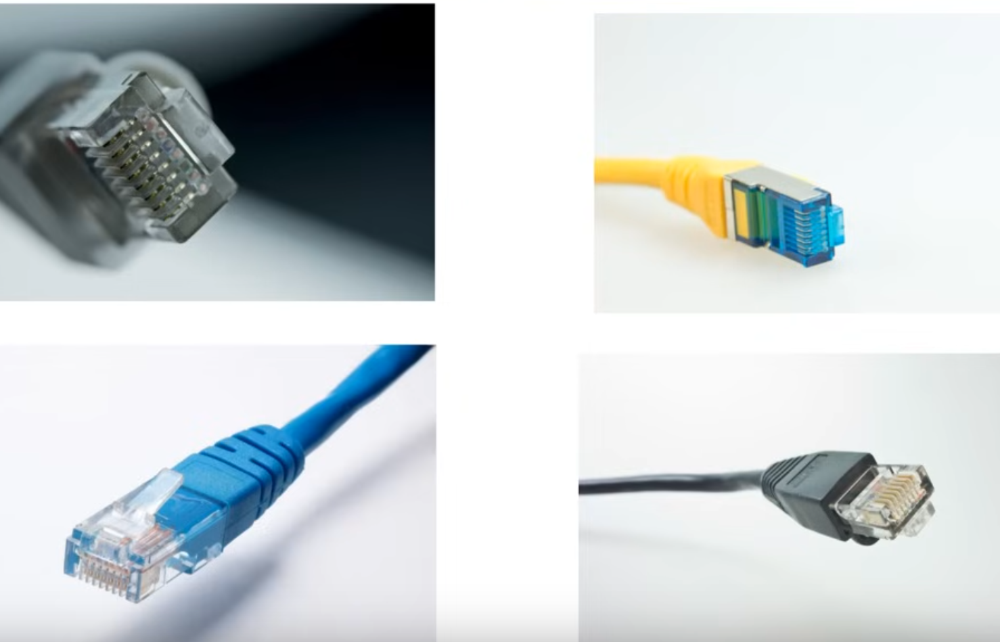
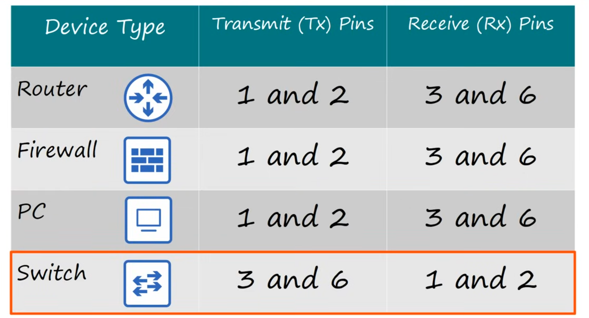
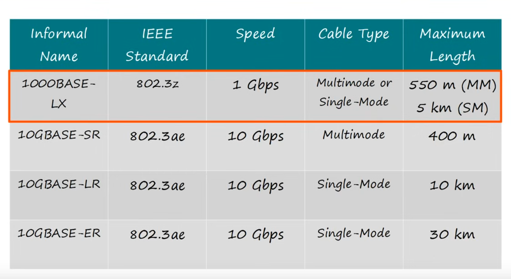

# CCNA Course - Day 2: Interfaces and Cables

## Reference
[Free CCNA | Interfaces and Cables | Day 2 | CCNA 200-301 Complete Course](https://www.youtube.com/watch?v=ieTH5lVhNaY&list=PLxbwE86jKRgMpuZuLBivzlM8s2Dk5lXBQ&index=4)

---

Each port on a network device serves as an **interface** and typically connects to an **RJ45** connector.

---

## Ethernet: A Collection of Network Protocols and Standards

### Why do we need standards?

Standards ensure interoperability between devices from different manufacturers and maintain consistent network performance and reliability.

### What is a bit and a byte?

- A **bit** is the smallest unit of data in networking.
- A **byte** consists of 8 bits.

### Speed Measurement in Networking

- Network speeds are measured in **bits per second** (e.g., Kbit/s, Mbit/s).
- Hardware speed is often measured in **bytes per second** (B/s).

* Measurement in hardware uses bytes per second (B/s).

---

## UTP Cable: Unshielded Twisted Pair

The **UTP (Unshielded Twisted Pair)** cable connects to an RJ45 connector.

---

### Full Duplex Connection

A full duplex connecti 

For connecting two devices of the same type (e.g., SW to SW), use a **crossover cable**:

Helpful table for identifying **RX** and **TX** pins:

---

### Auto MDI-X

Auto MDI-X enables devices to use straight-through cables even when connecting two similar devices, as it automatically detects and adjusts the signal paths.

### 1000Base-T and 10GBase-T Standards

In **1000Base-T** and **10GBase-T**, each twisted pair can operate bidirectionally, allowing data to flow in both directions on the same pair.

---

## Fiber Optic Cable

Fiber optic cables require **SFP (Small Form-Factor Pluggable)** transceivers for connection:

Fiber optic cables typically connect as **duplex**:

Fiber optic cables are made from four parts:

1. **Fiber Glass Core**: Transmits data using light.
2. **Cladding**: Reflects data back into the core.
3. **Protective Buffer**: Protects the core and cladding.
4. **Outer Jacket**: Provides external protection.

### Types of Fiber Optic Cable

1. **Single-mode fiber**  
2. **Multimode fiber**

- **Multimode fiber** has a wider core than single-mode.
- Allows for longer distances compared to UTP but shorter than single-mode.
- More cost-effective than single-mode (uses LEDs instead of lasers).

---

## Fiber Optic Cable Standards

---

## UTP vs Fiber-Optic Comparison

| **UTP**                       | **Fiber-Optic**                          |
|-------------------------------|------------------------------------------|
| Lower cost                    | Higher cost                              |
| Lower max distance (~100m)    | Longer max distance                      |
| Vulnerable to EMI (Electromagnetic Interference) | Immune to EMI             |
| Cheaper RJ45 ports            | More expensive SFP ports                 |
| Slight signal leakage (security risk) | No signal leakage outside cable |
