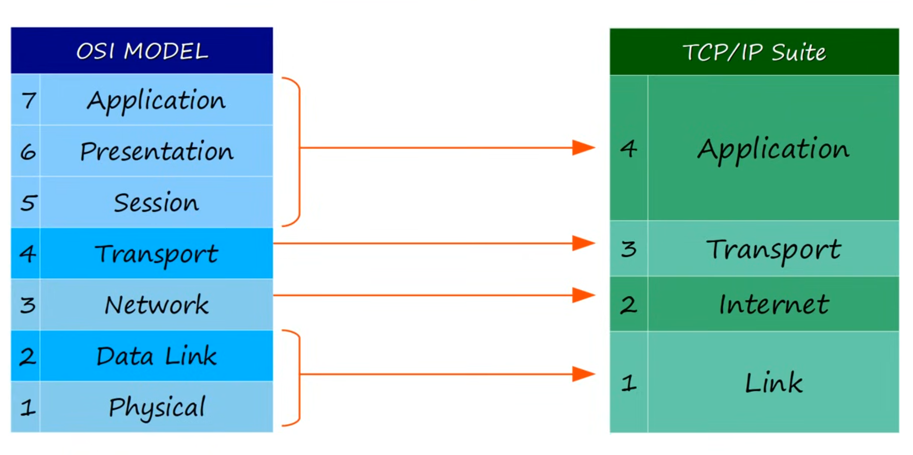
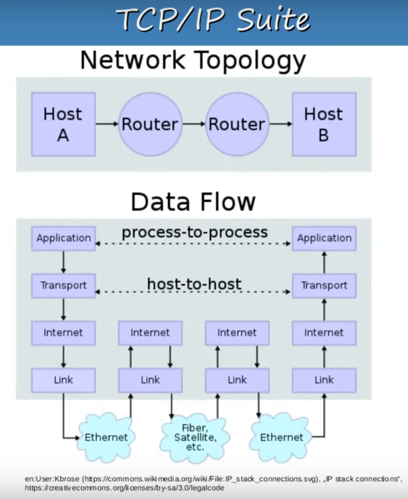

# CCNA Course - Day 2: Interfaces and Cables

## Reference
[Free CCNA | OSI Model & TCP/IP Suite | Day 3 | CCNA 200-301 Complete Course](https://www.youtube.com/watch?v=t-ai8JzhHuY&t=643s)

---

## What is a Network Model?

**Network models** provide a structured framework for organizing networking protocols and standards, enabling consistent communication and interoperability across different devices and networks.

## What is a Protocol?

A **protocol** is a set of logical rules that define how network devices and software communicate and interact.

---

# Network Models (OSI vs TCP/IP)

- **Encapsulation**: The process of adding protocol information (headers) to data as it moves down the OSI layers. Each layer adds its own header, creating a packet ready for transmission.

- **Adjacent-Layer Interaction**: Communication between two layers within the same device (e.g., Layer 4 interacting with Layer 3 on a device).

- **Same-Layer Interaction**: Communication between the same layer on two different devices (e.g., Layer 4 on Device A communicating with Layer 4 on Device B).

---

# OSI Model

## **The Top Three Layers: Application Layer**

These layers are mostly used by application developers to enable interactions between software applications.

### Layer 7 - Application
* Closest layer to the end-user.
* Examples: HTTPS, HTTP.
* Manages interactions with software applications (e.g., web browsers).
* Handles **process-to-process communication**.

### Layer 6 - Presentation
* Translates data between application format and network format.
* Responsible for **encryption** and **decryption** of data.

### Layer 5 - Session
* Manages dialogues (sessions) between communication hosts.
* Establishes, maintains, and terminates connections between local and remote applications (e.g., a browser and YouTube.com).
* Collectively, Layers 7, 6, and 5 create **DATA** for transmission.

---

## **Lower Layers: Networking Focus**

These layers are essential for network engineers, focusing on data transmission, addressing, and routing.

### Layer 4 - Transport
* Segments and reassembles data for reliable end-to-end communication.
* Divides large data into smaller segments for easier transmission and error handling.
* Provides **host-to-host communication**.
* **Segmentation**: Dividing data into manageable segments.
* Data + L4 Header = **Segment**.

### Layer 3 - Network
* Adds a Layer 3 header to data from Layer 4.
* Manages **logical addressing** (IP addresses) and **path selection** for packets.
* Routers operate at this layer.
* Connects different networks.
* Data + L4 Header + L3 Header = **Packet**.

### Layer 2 - Data-Link
* Provides **node-to-node** connections.
* Formats data for transmission over the physical medium (e.g., UTP cable).
* Detects and potentially corrects physical layer errors.
* Uses **Layer 2 addressing** (MAC address, a 48-bit hexadecimal address).
* Switches operate at Layer 2.
* L2 Trailer + Data + L4 Header + L3 Header + L2 Header = **Frame**.

### Layer 1 - Physical
* Defines the physical characteristics of the transmission medium (e.g., voltage, max transmission distance).
* Converts digital bits into electrical (wired) or radio signals (wireless).

---

## Data Flow in OSI Model

1. **Device A**: Encapsulates data starting from Layer 7 down to Layer 1.
2. The data is transmitted to **Device B**.
3. **Device B**: Receives the data at Layer 1 and reassembles it while moving up to Layer 7, de-encapsulating the data at each layer.

---

# TCP/IP Model
* Similar to the OSI model, but it's the actual model used in modern networks.
* **Note**: The OSI model still influences how network engineers discuss issues. For example, when a network engineer says, "we have a problem at Layer 2," they mean Layer 2 in the OSI model.
* In the TCP/IP model, the **Link Layer** combines the functions of the Data-Link and Physical layers from the OSI model.

---

## Example: How Communication Works in a Network
This example demonstrates the process of communication between devices in a network:

