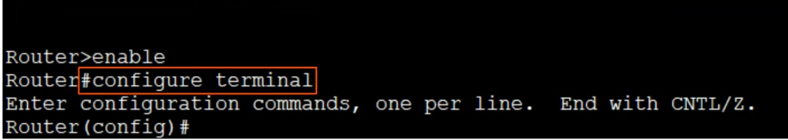

# CCNA Course - Day 2: Interfaces and Cables

## Reference
[Free CCNA | Intro to the CLI | Day 4 | CCNA 200-301 Complete Course](https://www.youtube.com/watch?v=IYbtai7Nu2g&list=PLxbwE86jKRgMpuZuLBivzlM8s2Dk5lXBQ&index=8)

---

## What is CLI?

* **CLI** stands for **Command-Line Interface**.
* It's the interface used to configure Cisco devices.
* Cisco also offers a **GUI (Graphical User Interface)**.

---

## How to Connect to a Cisco Device

* Connect via the **Console Port** (usually a blue port on Cisco devices, supporting RJ45, Micro-USB, etc.).

### Connecting RJ45 to a PC

* Use a **console cable** and an adapter.
* The console cable is a **roll-over cable**.

### Connecting to a Cisco Device via Console Cable

1. Use software like **PuTTY** with the following settings:
   

---

## CLI Environment

### User EXEC Mode
* The first mode upon connecting is called **User EXEC Mode** (also referred to as **User Mode**).
* This mode has limited access.

### Privileged EXEC Mode
* Access **Privileged EXEC Mode** by entering the `enable` command.
* Provides complete access to view the device configuration, restart the device, etc.
* Cannot modify the configuration, but can change time, save configurations, and more.

* Tip: You can use **abbreviated commands** for quicker access.

### Global Configuration Mode
* Enter **Global Configuration Mode** from Privileged EXEC Mode to configure the device.

* Use the `?` command to explore available options:
  * `?` : Shows all commands available at the current level.
  * `e?` : Lists commands starting with "e".
  * `password?` : Displays commands that start with "password".
  * `password ?` : Shows all possible actions after `password`.
  * `<cr>` indicates no further input is required.

Example:

* Use `exit` to return to the previous mode.

---

## Configuration Files

* **Running Configuration** (`running-config`): The current, active configuration on the device. Changes are immediately applied.
* **Startup Configuration** (`startup-config`): The configuration that loads upon device reboot.

* Commands:
  * `show running-config` : Displays the current active configuration.
  * `write` or `copy running-config startup-config` : Saves the running configuration as the startup configuration.
  * `show startup-config` : Displays the saved startup configuration.

* **Password Encryption**:
  * By default, passwords are visible in the config file.
  * To encrypt passwords, use `service password-encryption` in **Global Configuration Mode** (`Router(config)#`).
  * For more security, use an MD5-encrypted password with the command `enable secret <password>`.

* Example commands:
  * `do sh run` : Shows the running configuration.
  * `no service password-encryption` : Disables password encryption.

---

## Notes on Password Encryption

* Enabling `service password-encryption`:
  * Encrypts current and future passwords.
  * Does **not** affect the `enable secret` (which is already encrypted with MD5).

* Disabling `service password-encryption`:
  * Existing passwords remain encrypted, but future passwords will not be encrypted.
  * The `enable secret` remains unaffected.

